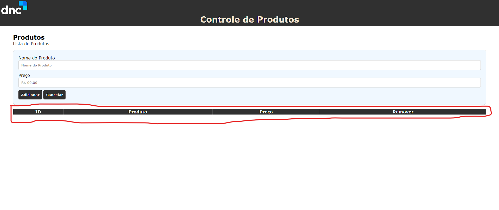
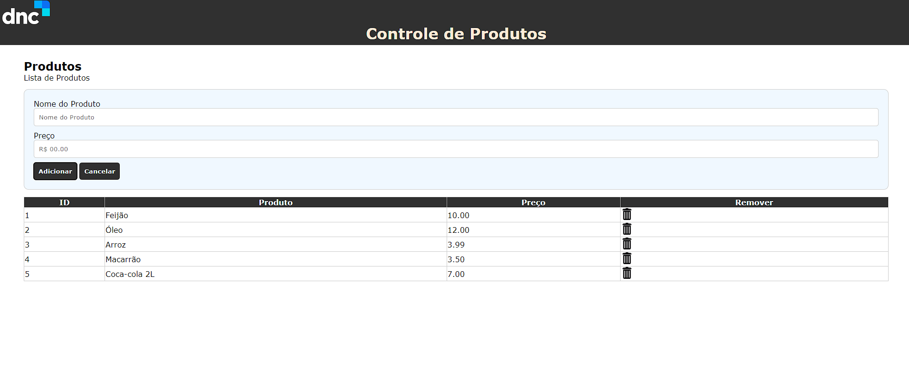

# Gerenciador_de_Produtos_JS
Esse é um simples gerenciador de produtos, no qual é possível, <b>"Adicionar"<b>, <b>"Cancelar"<b>, <b>"Deletar"<b>, sendo possível o organizar em uma tabela com id, nome e preço do produto.

## Exemplos de Uso

Já que conta com um sistema de tabela, dividido por <b>Id<b>, <b>Nome<b>, <b>Preço<b>, pode muito bem utiliza-lo para como o nome já sugeri, Gerenciar seus Produtos, assim podendo usar como uma espécie de catálogo, podendo manter tudo em ordem e bem mais organizado.

## Contribuição

Para contribuir com o projeto você pode fazer um clone desse repositório, criar uma branch fazer suas edições||adições e depois fazer um <b>Pull Request.<b>

## Licença

MIT

## Tecnologias Usadas
Nesse projeto utilizo das tecnologias
<ul>
    <li>HTML</li>
    <li>CSS</li>
    <li>JavaScript</li>
</ul>

No qual utilizo um modelo simples de <b>CRUD<b> desenvolvido em <b>Javascript<b>

## Site
[Gerenciador-De-Produtos](https://marcelo-anselmo.github.io/Gerenciador_de_Produtos/)

## Contato

<a href="https://www.linkedin.com/in/marcelo-anselmo-41587b280/" targuet="_blank">Linkedin</a>  
<a href="https://github.com/Marcelo-Anselmo" targuet="_blank">Github</a>
